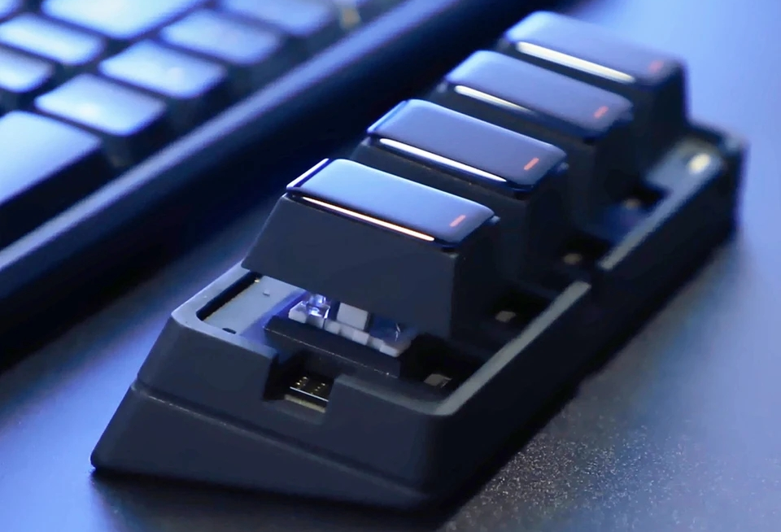
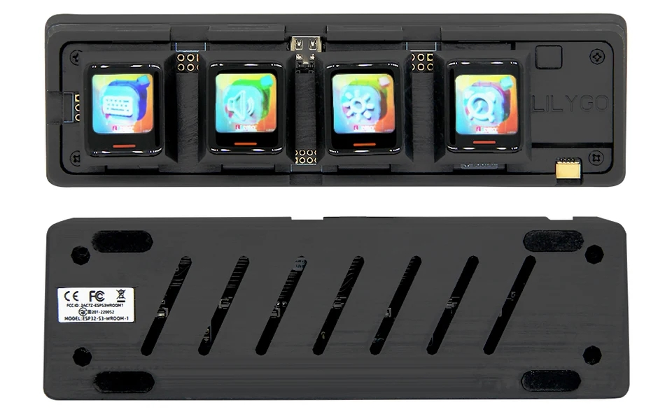
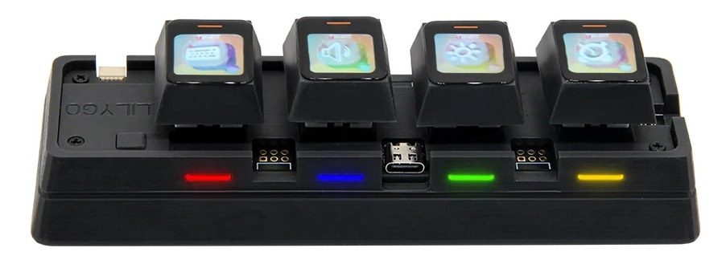

<!--
 * @Description: None
 * @Author: LILYGO_L
 * @Date: 2023-09-11 16:13:14
 * @LastEditTime: 2024-11-11 18:05:55
 * @License: GPL 3.0
-->
<!-- <h1 align = "center">T-Keyboard-S3</h1> -->

    

 
  
  
  

 

## **English | [中文](./README_CN.md)**

## Version iteration:
| Version                              | Update date                       |
| :-------------------------------: | :-------------------------------: |
| T-Keyboard-S3_V1.0           | 2023-09-04                         |

## PurchaseLink

| Product                     | SOC           |  FLASH  |  PSRAM   | Link                   |
| :------------------------: | :-----------: |:-------: | :---------: | :------------------: |
| T-Keyboard-S3_V1.0   | ESP32S3R8 |   16M   | 8M (Octal SPI) |  [aliexpress](https://a.aliexpress.com/_mqY5Heu)  |

## Directory
- [Describe](#describe)
- [Preview](#preview)
- [Module](#module)
- [QuickStart](#quickstart)
- [PinOverview](#pinoverview)
- [FAQ](#faq)
- [Project](#project)
- [Information](#information)
- [DependentLibraries](#dependentlibraries)

## Describe

T-Keyboard-S3 is an intelligent key controller developed based on the ESP32-S3-WROOM-1 module. It is different from traditional controllers as it features a 0.85-inch 128x128 RGB pixel LCD screen above the keys. It is connected to the main control board of the baseboard through an FPC ribbon cable and is compatible with programming libraries such as ArduinoGFX, TFTeSPI, and lvgl. The four keys are compatible with regular hot-swappable mechanical keyboard switches, allowing for the replacement of different switch types (specific switch properties will be mentioned in the following introduction).

T-Keyboard-S3 can be connected to a Windows 10 computer via a wired USB connection to function as a mini wired keyboard. It can also be used as a Bluetooth keyboard by establishing a wireless Bluetooth connection.

T-Keyboard-S3 has abundant expansion IO ports, allowing for the connection of modules in three directions. The default configuration includes a front speaker, a left rotary encoder, and a five-way directional key below. You can also connect other modules to explore more interesting functions.

## Preview

### Actual Product Image

    

---

    

### PCB board

#### T-Keyboard-S3 Front

    

---

#### T-Keyboard-S3 Back

    

---

#### T-Keyboard-S3_FPC Front And Back

    

## Module

### 1. MCU

* Model: ESP32­-S3-WROOM­-1
* Chip: ESP32-S3-R8
* PSRAM: 8M (Octal SPI)
* FLASH: 16M
* Others: For more information, please visit[Espressif Official ESP32-S3-WROOM-1 datasheet](https://www.espressif.com/sites/default/files/documentation/esp32-s3-wroom-1_wroom-1u_datasheet_en.pdf)

### 2. Screen

* Screen Model: N085-1212TBWIG06-C08
* Size: 0.85-inch
* Resolution Ratio: 128x128px
* Screen Type: TFT
* Driver Chip: GC9107
* Bus Communication Protocol: Standard SPI
* Others: The RST, DC, MOSI, SCLK, and BL pins of the four screens share a common bus. During initialization, all four screens are reset together, and by selecting different CS lines, you can control the refreshing data for each screen separately.

### 3. Hot swappable button

* Specifications: The selected hot-swappable connector is from Kailh company, with a pin spacing of 6.35mm, making it compatible with all hot-swappable pins and buttons with a 6.35mm spacing.
* PCB connection: The default configuration for the KEY1 to KEY3 pins does not include pull-up resistors, but there is a reserved position for a pull-up resistor. Pulling these pins low enables them to serve as judgment signals. KEY4 is multiplexed as BOOT-0 for system power-on mode selection by default, with a 10K pull-up resistor. Similarly, pulling this pin low serves as the judgment signal. To ensure stable operation, you must configure the corresponding pin as an internal pull-up in the software.
* Others: Because screens need to be connected, please make sure to choose hot-swappable buttons with an opening in the middle, and the spacing should be greater than 7mm, which is wider than the ribbon cable width.

### 4. Fixing hole screws

* Specifications: The hole diameter on the PCB is 2.5mm. When selecting screws for fastening, please choose ones with a diameter below 2.5mm.

## QuickStart

### Examples Support

| Example | Support IDE And Version| Description | Picture |
| ------  | ------  | ------ | ------ | 
| [WS2812B_ColorPalette](./examples/WS2812B_ColorPalette) | `[Platformio IDE][espressif32-v6.5.0]` `[Arduino IDE][esp32_v2.0.14]` |  |  |
| [T-Keyboard-S3_Test](./examples/T-Keyboard-S3_Test) | `[Platformio IDE][espressif32-v6.5.0]` `[Arduino IDE][esp32_v2.0.14]` | Product factory original testing |  |
| [WS2812B_Key](./examples/WS2812B_Key) | `[Platformio IDE][espressif32-v6.5.0]` `[Arduino IDE][esp32_v2.0.14]` |  |  |
| [WS2812B_WiFiServer](./examples/WS2812B_WiFiServer) | `[Platformio IDE][espressif32-v6.5.0]` `[Arduino IDE][esp32_v2.0.14]` |  |  |
| [GFX](./examples/GFX) | `[Platformio IDE][espressif32-v6.5.0]` `[Arduino IDE][esp32_v2.0.14]` |  |  |
| [GFX_Image](./examples/GFX_Image) | `[Platformio IDE][espressif32-v6.5.0]` `[Arduino IDE][esp32_v2.0.14]` |  |  |
| [TFT](./examples/TFT) | `[Platformio IDE][espressif32-v6.5.0]` `[Arduino IDE][esp32_v2.0.14]` |  |  |
| [lvgl](./examples/lvgl) | `[Platformio IDE][espressif32-v6.5.0]` `[Arduino IDE][esp32_v2.0.14]` |  |  |
| [GFX_Test](./examples/GFX_Test) | `[Platformio IDE][espressif32-v6.5.0]` `[Arduino IDE][esp32_v2.0.14]` |  |  |
| [Keyboard](./examples/Keyboard) | `[Platformio IDE][espressif32-v6.5.0]` `[Arduino IDE][esp32_v2.0.14]` |  |  |
| [ChipScan](./examples/ChipScan) | `[Platformio IDE][espressif32-v6.5.0]` `[Arduino IDE][esp32_v2.0.14]` |  |  |
| [Lvgl_UI](./examples/Lvgl_UI) | `[Platformio IDE][espressif32-v6.5.0]` `[Arduino IDE][esp32_v2.0.14]` |  |  |

| Firmware | Description | Picture |
| ------  | ------  | ------ |
| [T-Keyboard-S3_Test_firmware_V1.0.1](./firmware/T-Keyboard-S3_Test_firmware_V1.0.1.bin) | Added WiFi test routine |  |

### PlatformIO
1. Install[VisualStudioCode](https://code.visualstudio.com/Download),Choose installation based on your system type.

2. Open the "Extension" section of the Visual Studio Code software sidebar(Alternatively, use "<kbd>Ctrl</kbd>+<kbd>Shift</kbd>+<kbd>X</kbd>" to open the extension),Search for the "PlatformIO IDE" extension and download it.

3. During the installation of the extension, you can go to GitHub to download the program. You can download the main branch by clicking on the "<> Code" with green text, or you can download the program versions from the "Releases" section in the sidebar.

4. After the installation of the extension is completed, open the Explorer in the sidebar(Alternatively, use "<kbd>Ctrl</kbd>+<kbd>Shift</kbd>+<kbd>E</kbd>" go open it),Click on "Open Folder," locate the project code you just downloaded (the entire folder), and click "Add." At this point, the project files will be added to your workspace.

5. Open the "platformio.ini" file in the project folder (PlatformIO will automatically open the "platformio.ini" file corresponding to the added folder). Under the "[platformio]" section, uncomment and select the example program you want to burn (it should start with "default_envs = xxx") Then click "<kbd>[√](image/4.png)</kbd>" in the bottom left corner to compile,If the compilation is correct, connect the microcontroller to the computer and click "<kbd>[→](image/5.png)</kbd>" in the bottom left corner to download the program.

### Arduino
1. Install[Arduino](https://www.arduino.cc/en/software),Choose installation based on your system type.

2. Open the "example" directory within the project folder, select the example project folder, and open the file ending with ".ino" to open the Arduino IDE project workspace.

3. Open the "Tools" menu at the top right -> Select "Board" -> "Board Manager." Find or search for "esp32" and download the board files from the author named "Espressif Systems." Then, go back to the "Board" menu and select the development board type under "ESP32 Arduino." The selected development board type should match the one specified in the "platformio.ini" file under the [env] section with the header "board = xxx." If there is no corresponding development board, you may need to manually add the development board from the "board" directory within your project folder.

4. Open menu bar "[File](image/6.png)" -> "[Preferences](image/6.png)" ,Find "[Sketchbook location](image/7.png)"  here,copy and paste all library files and folders from the "libraries" folder in the project directory into the "libraries" folder in this directory.

5. Select the correct settings in the Tools menu, as shown in the table below.

| Setting                               | Value                                 |
| :-------------------------------: | :-------------------------------: |
| Board                                | ESP32S3 Dev Module              |
| Upload Speed                     | 921600                               |
| USB Mode                           | Hardware CDC and JTAG     |
| USB CDC On Boot                | Enabled                             |
| USB Firmware MSC On Boot | Disabled                             |
| USB DFU On Boot                | Disabled                             |
| CPU Frequency                   | 240MHz (WiFi)                    |
| Flash Mode                         | QIO 80MHz                         |
| Flash Size                           | 16MB (128Mb)                     |
| Core Debug Level                | None                                 |
| Partition Scheme                | 16M Flash (3MB APP/9.9MB FATFS) |
| PSRAM                                | OPI PSRAM                         |
| Arduino Runs On                  | Core 1                               |
| Events Run On                     | Core 1                               |

6. Select the correct port.

7. Click "<kbd>[√](image/8.png)</kbd>" in the upper right corner to compile,If the compilation is correct, connect the microcontroller to the computer,Click "<kbd>[→](image/9.png)</kbd>" in the upper right corner to download.

### firmware download
1. Open the project file "tools" and locate the ESP32 burning tool. Open it.

2. Select the correct burning chip and burning method, then click "OK." As shown in the picture, follow steps 1->2->3->4->5 to burn the program. If the burning is not successful, press and hold the "BOOT-0" button and then download and burn again.

3. Burn the file in the root directory of the project file "[firmware](./firmware/)" file,There is a description of the firmware file version inside, just choose the appropriate version to download.

    
    

## PinOverview

| Display pin         | ESP32S3 pin       |
| :------------------: | :------------------:|
| DC                     | IO45                  |
| SCLK                  | IO47                  |
| MOSI                  | IO48                  |
| MISO                  | -1                      |
| RST                    | IO38                  |
| BL                      | IO39                  |
| CS1                    | IO12                  |
| CS2                    | IO13                  |
| CS3                    | IO14                  |
| CS4                    | IO21                  |

| Key pin              | ESP32S3 pin       |
| :------------------: | :------------------:|
| KEY1                  | IO10                  |
| KEY2                  | IO9                    |
| KEY3                  | IO46                  |
| KEY4                  | IO3                    |

| Other pins          | ESP32S3 pin       |
| :------------------: | :------------------:|
| WS2812C_Data    | IO11                 |

## FAQ

* Q. After reading the above tutorials, I still don't know how to build a programming environment. What should I do?
* A. If you still don't understand how to build an environment after reading the above tutorials, you can refer to the [LilyGo-Document](https://github.com/Xinyuan-LilyGO/LilyGo-Document) document instructions to build it.

 

* Q. Why does Arduino IDE prompt me to update library files when I open it? Should I update them or not?
* A. Choose not to update library files. Different versions of library files may not be mutually compatible, so it is not recommended to update library files.

 

* Q. Why is there no serial data output on the "Uart" interface on my board? Is it defective and unusable?
* A. The default project configuration uses the USB interface as Uart0 serial output for debugging purposes. The "Uart" interface is connected to Uart0, so it won't output any data without configuration. For PlatformIO users, please open the project file "platformio.ini" and modify the option under "build_flags = xxx" from "-D ARDUINO_USB_CDC_ON_BOOT=true" to "-D ARDUINO_USB_CDC_ON_BOOT=false" to enable external "Uart" interface. For Arduino users, open the "Tools" menu and select "USB CDC On Boot: Disabled" to enable the external "Uart" interface.

 

* Q. How to enable PSRAM on T-Keyboard-S3?
* A. The chip used in T-Keyboard-S3 is ESP32S3R8, which only has internal PSRAM available.  For PlatformIO users, please open the project file "platformio.ini" and use the option "-D BOARDHASPSRAM" under "buildflags = xxx". Also, use "boardbuild.arduino.memorytype = qioopi" to enable the internal PSRAM.  For Arduino users, open the "Tools" menu and select "PSRAM: OPI PSRAM" to use the internal PSRAM normally.

 

* Q. Why is my board continuously failing to download the program?
* A. Please hold down the "BOOT-0" button and try downloading the program again.

## Project
* [SCH_T-Keyboard-S3_V1.0](./Project/SCH_T-Keyboard-S3_V1.0.pdf)
* [SCH_T-Keyboard-S3-FPC_V1.0](./Project/SCH_T-Keyboard-S3-FPC_V1.0.pdf)

## Information
* [ESP32-S3-WROOM-1-N16R2](./information/ESP32-S3-WROOM-1-N16R2.pdf)
* [WS2812B-2020](./information/WS2812B-2020.pdf)
* [WS2812C-2020](./information/WS2812C-2020.pdf)

## DependentLibraries
* [Arduino_GFX-1.3.7](https://github.com/moononournation/Arduino_GFX)
* [FastLED-3.6.0](https://github.com/FastLED/FastLED)
* [lvgl](https://github.com/lvgl/lvgl)
* [TFT_eSPI](https://github.com/Bodmer/TFT_eSPI)